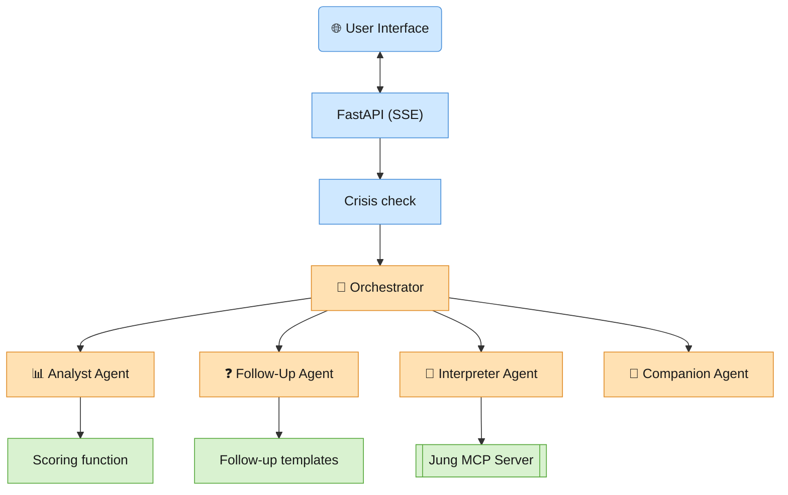

# Meet Your Shadow
### A quiet AI agent for the parts of you that rarely get asked.

A single-session, multi-agent self-reflection tool built on the [Google Agent Development Kit (ADK)](https://google.github.io/adk-docs/). The user answers 16 Likert-scale questions, the system detects psychological tension between paired questions, asks one to three clarifying follow-ups, and generates a personalized narrative grounded in real psychological concepts — then lets the user keep talking about it.

**Live demo:** https://shadow-agent-887841120412.us-east1.run.app/app

---

## Problem Statement

Everyone carries parts of themselves they've learned not to look at directly — a need they've relabeled as weakness, an anger they've stopped believing they feel, a want they've decided is selfish. By definition, these patterns are hard to see head-on: they're not absent, they're *displaced* — showing up instead as an outsized reaction to seeing that same trait in someone else (what Jungian psychology calls projection).

Most self-assessment tools handle this badly in one of two directions. Generic personality quizzes ask directly ("Are you an angry person?") and get a socially-desirable answer, because the whole point of a denied trait is that a person won't self-report it accurately when asked head-on. Clinical-sounding tools go the other way — diagnostic language that feels like being handed a label, not an invitation to notice something.

This project is a bet that the interesting version of this problem sits in between: score the *gap* between what someone says about themselves and what they say about others (the same question, asked twice, once inward and once outward), use that gap — not a direct question — to find the pattern, and then write about it in language that never diagnoses, never lists fixes, and treats the reader as someone capable of noticing something on their own.

## Agents

Why build this as multiple agents instead of one large prompt? Because the steps genuinely split into two categories that shouldn't be entrusted to the same failure mode:

- **Steps that must be exactly right, every time** — scoring the tension formula, looking up a fixed follow-up question's exact wording, detecting crisis language before anything else runs. Getting any of these wrong isn't a matter of style; a hallucinated score undermines the whole premise, and crisis detection in particular is a safety-relevant path that must never depend on a model deciding to notice. These are plain Python functions — no LLM involved.
- **Steps that must be adaptive** — writing a narrative that actually reflects *this* person's specific answers, and holding a natural conversation about it afterward. These need a model, and need room to vary.

A single prompt blurs that line — it's tempting for "the same call" to sometimes compute its own numbers, sometimes improvise a crisis response, sometimes drift in tone. Splitting into small, single-responsibility agents behind one Orchestrator (whose only job is *deciding which specialist to call next*) buys several things:

- **Deterministic guarantees exactly where correctness matters.** Analyst Agent and Follow-Up Agent each wrap a small deterministic function — scoring math and template lookup, not LLM output — and crisis-keyword detection runs as plain Python before the Runner is ever invoked.
- **Narrow, reviewable prompts.** Each agent's instruction covers one job, which makes it far easier to reason about and adjust than one sprawling system prompt trying to do everything.
- **Right-sized models per job.** `AnalystAgent`'s entire task is "call one function, summarize the result in one sentence" — it runs on `gemini-flash-lite-latest` (fast, cheap), while the narrative-quality agents (`InterpreterAgent`, `CompanionAgent`) run on `gemini-flash-latest`. That split would be awkward to express in one prompt/one model.
- **Tool access scoped tightly.** Only `InterpreterAgent` has the Jungian-concept search tool (via MCP) — the agent that actually needs to ground a narrative in a psychological concept, and no other.
- **A trace that means something.** Because each step is its own named agent, the frontend can show the user, live, which part of the system is running — analyzing, presenting a question, writing, or just talking — instead of one opaque black box.

## Architecture



**Session state** (per user session) is the single source of truth all agents read and write through: `answers`, `tension_scores`, `top_type`, `followup_queue`, `followup_answers`, `report_generated`, `final_report`, `grounding_concepts`, `current_followup`.

A few non-obvious decisions worth calling out:

- **`AgentTool` gives each sub-agent a brand-new session per call.** State is copied in and state deltas copied back out, but there's no persistent chat history across calls — that's why `CompanionAgent` reads `final_report` back out of state for continuity instead of relying on conversation memory, and why `FollowUpAgent`/`InterpreterAgent` write their structured results (`current_followup`, `grounding_concepts`) into state rather than just returning them — a nested agent's raw tool call/response is invisible to the Orchestrator's outer event stream, but state writes propagate through regardless of nesting depth.
- **`skip_summarization=True`** on `InterpreterAgent` and `CompanionAgent`: both are always the last call in their turn, so having the Orchestrator generate a *second* pass re-narrating what they already said well would only add latency, cost, and a chance of an awkward cutoff. Their exact text is relayed verbatim.
- **Crisis detection never touches the Runner.** `is_crisis_text()` runs in the FastAPI layer, before any session/agent is invoked, and short-circuits straight to a fixed, non-LLM-generated safety message.
- **The follow-up flow is deterministic about *how many* questions to ask** (1–3): the highest-tension shadow type always gets one; the 2nd and 3rd highest only get one if they independently trip the same denial/projection threshold.

## The Build

- **[Google ADK (Python)](https://google.github.io/adk-docs/)** — `Agent`/`LlmAgent`, `AgentTool` for agent-as-tool composition, `FunctionTool`s for the deterministic steps, session state, and `after_agent_callback`/`after_tool_callback` hooks for cross-agent state propagation.
- **Gemini models** — `gemini-flash-latest` for the Orchestrator and the narrative-quality agents; `gemini-flash-lite-latest` for `AnalystAgent`, since its job is mechanical (call a function, summarize in one sentence).
- **[Model Context Protocol (MCP)](https://modelcontextprotocol.io/)** — a small custom server (`mcp/jung_mcp_server.py`, built with `FastMCP`) exposing one tool, `search_jung_concepts`, over a curated JSON corpus of Jungian psychology concepts (`mcp/jung_mcp_corpus.json`). Connected via stdio, spawned as a subprocess of the ADK app.
- **FastAPI + Server-Sent Events** — the three custom endpoints (`/api/answers`, `/api/followup-batch`, `/api/message`) stream each tool call/response event live, so the frontend can show which agent is running in real time rather than a blank loading spinner.
- **A single self-contained HTML/CSS/JS frontend** (`frontend/index.html`) — no framework, no build step, served directly by the FastAPI app.
- **[`google-agents-cli`](https://github.com/google/agents-cli)** — project scaffolding, local dev (`agents-cli run`), and deployment (`agents-cli deploy`) to Cloud Run.
- **`uv`** for Python dependency management.

Built iteratively in conversation with Claude Code and Antigravity: starting from a written spec, through an architecture addendum (splitting deterministic tools into their own thin agents + adding the MCP tool), through several rounds of live testing that caught real bugs — a nested-agent visibility issue that made follow-up questions and MCP grounding invisible to the frontend, and a redundant re-narration pass that was silently truncating conversation replies.

---

## Running Locally

**Prerequisites:** Python 3.11+, [`uv`](https://docs.astral.sh/uv/getting-started/installation/), and a Gemini API key ([aistudio.google.com/apikey](https://aistudio.google.com/apikey) — no billing required).

```bash
git clone <this-repo-url>
cd shadow-agent
uv sync

cp .env.example .env
# edit .env and set GEMINI_API_KEY to your key

uv run uvicorn app.fast_api_app:app --reload --port 8000
```

Open **http://localhost:8000/app**.

Other useful commands:
```bash
uv run pytest tests/unit tests/integration   # run the test suite
uv run python scripts/chat.py                # answer the 16 questions from the terminal
```

## Deploying to Cloud Run

The `Dockerfile` and `deployment/terraform/` were generated by `agents-cli scaffold enhance . --deployment-target cloud_run` ([install `agents-cli`](https://github.com/google/agents-cli) if you don't have it) and are already part of this repo — no extra scaffolding step needed.

```bash
# One-time: enable the required GCP APIs
gcloud services enable cloudbuild.googleapis.com secretmanager.googleapis.com \
  run.googleapis.com artifactregistry.googleapis.com --project=<PROJECT_ID>

# Deploy — reads GEMINI_API_KEY (and other vars) from your local .env automatically
agents-cli deploy --project <PROJECT_ID> --region <REGION> --no-confirm-project

# This app is meant to be opened directly in a browser, so allow public access
# (agents-cli deploy defaults to authenticated-only)
gcloud run services add-iam-policy-binding shadow-agent \
  --project=<PROJECT_ID> --region=<REGION> \
  --member="allUsers" --role="roles/run.invoker"
```

`agents-cli deploy` merges your local `.env` straight into the deployed service's environment variables, which is fine for a personal/dev deployment. For anything more sensitive, use `--secrets ENV_VAR=SECRET_ID` instead and store the value in GCP Secret Manager.
